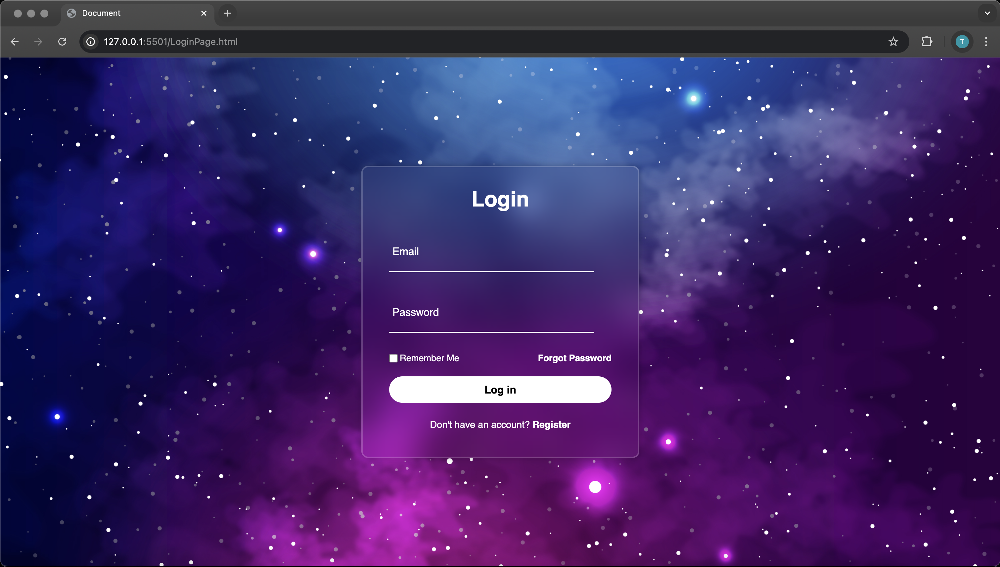

# Glassmorphism Login Page

This is a sleek and modern login page featuring a glassmorphism design. Built using only HTML and CSS, the form showcases subtle animations, icon-enhanced fields, and a frosted-glass-style container over a background image. It's fully responsive and designed for front-end development practice.

## 🌐 Demo

[View Live Demo] https://github.com/tarik-thomas/LoginPage

## 📄 Project Description

This login page is styled with **glassmorphism**, using blur effects, semi-transparent backgrounds, and soft shadows. The page is centered using Flexbox and includes icons for better UX.

### ✅ Features

- Glassmorphism UI using `backdrop-filter`
- Responsive and centered layout
- Floating label animation on input focus
- Styled checkbox and password recovery link
- Box-style icons using Ionicons
- Background image covering full screen

## 🛠️ Technologies Used

- HTML5
- CSS3 (Flexbox, backdrop-filter)
- [Ionicons](https://ionic.io/ionicons)
- Google Fonts: _Poppins_

## 📁 Folder Structure

├── LoginPage.html
├── style.css
├── img.jpg
└── README.md

## 📸 Screenshot

  

## 📚 Learning Goals

- Practice using Flexbox for layout
- Learn how to style forms with CSS only
- Explore glassmorphism and floating label UI patterns
- Prepare and deploy projects to GitHub Pages

## 🚧 Future Improvements

- Add form validation with JavaScript
- Include error messages for empty/invalid fields
- Hook into a real authentication backend

## 📬 Contact

**Tarik Thomas**  
📧 tarik_thomas@hotmail.com
